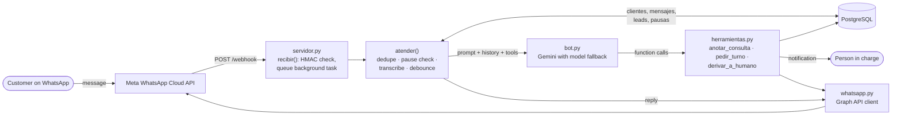

# WhatsApp assistant for small businesses

[](https://github.com/leosuarrzz/bot-whatsapp/actions/workflows/tests.yml)

A multi-tenant WhatsApp bot that answers customers on behalf of small local
businesses (car workshops, shoe stores, clinics) using the WhatsApp Cloud API
and Google Gemini.

Small shops get most of their inquiries through WhatsApp, and the owner is
usually busy doing the actual work. Messages pile up, and the same questions
(opening hours, address, "how much is a service?") get answered late or not
at all. This bot answers what the business has explicitly told it, says "I'll
check" for everything else, records those inquiries as leads, and notifies
the person in charge on their own WhatsApp.

<!-- DEMO GIF -->

> The code, prompts and client configuration are in Spanish (Rioplatense)
> because the bot serves businesses in Uruguay. Identifiers are kept in
> Spanish on purpose.

## Features

- **Multi-tenant.** One deployment serves several businesses. Each one has a
  profile (`ficha`) with its tone, known facts, limits, rules and enabled
  tools, stored as JSONB in PostgreSQL and selected by the WhatsApp
  `phone_number_id` the message arrived at.
- **Function calling.** Gemini decides when to call three tools, enabled per
  business:
  - `anotar_consulta` — lead capture: records what the customer asked for and
    notifies the person in charge.
  - `pedir_turno` — appointment requests: only records the request once it has
    the vehicle, the job and a preferred time; it never confirms a booking.
  - `derivar_a_humano` — human handoff: notifies the person in charge and
    pauses the bot in that conversation for 2 hours.
- **Webhook signature verification.** Every request is checked against the
  `X-Hub-Signature-256` header with HMAC-SHA256 and a constant-time
  comparison.
- **Idempotency.** WhatsApp can deliver the same message more than once. Each
  message is stored with its WhatsApp id under a unique index, and repeated ids
  are ignored.
- **Debounce of split messages.** People often send one idea in several short
  messages. The bot waits a few seconds and only answers the last message of a
  burst, with the whole conversation as context.
- **Voice notes.** Audio messages are downloaded from the Graph API,
  transcribed with Gemini and then handled like any text message.
- **Model fallback.** If a Gemini model fails, the request is retried and then
  sent to the next model in a list. If a tool already ran, the bot does not
  retry, so leads and notifications are not duplicated.
- **Time awareness.** The prompt includes the current date and time in the
  business's time zone, so the bot can tell whether the shop is open now.

## Architecture



## Stack

- Python 3.14, FastAPI, Uvicorn
- WhatsApp Cloud API (Meta Graph API)
- Google Gemini through the `google-genai` SDK (automatic function calling)
- PostgreSQL through `psycopg` 3
- pytest and GitHub Actions
- Deployed on Railway

## Project structure

```
.
├── servidor.py          # FastAPI app: webhook, signature check, message flow
├── bot.py               # Prompt building, Gemini calls with fallback, transcription
├── herramientas.py      # Tools the model can call (lead, appointment, handoff)
├── whatsapp.py          # WhatsApp Cloud API client
├── datos.py             # PostgreSQL access
├── clientes/            # Business profiles (only demo-*.yaml are versioned)
├── pruebas/             # Question scripts for manual prompt testing
├── scripts/             # Maintenance scripts (see scripts/README.md)
├── tests/               # pytest suite, fully mocked
├── Procfile             # Start command for Railway
├── requirements.txt
└── requirements-dev.txt
```

## Running locally

Requirements: Python 3.14 and a PostgreSQL database.

```bash
python -m venv venv
source venv/bin/activate        # Windows: venv\Scripts\activate
pip install -r requirements-dev.txt
cp .env.example .env            # then fill in the values
```

Create the tables and load the business profiles:

```bash
python -m scripts.crear_tablas
python -m scripts.cargar_fichas
```

Talk to a bot in the terminal, without WhatsApp:

```bash
python -m scripts.chat demo-zapateria
```

Run the server:

```bash
uvicorn servidor:app --reload
```

To receive real WhatsApp messages locally, expose the server with a tunnel
(for example `cloudflared` or `ngrok`) and use `https://<tunnel>/webhook` as the
callback URL in the Meta app.

Run the tests:

```bash
python -m pytest
```

## Deploying on Railway

1. Create a Railway project from this repository and add a PostgreSQL
   service.
2. Set the variables from `.env.example` in the web service. `DATABASE_URL`
   can reference the PostgreSQL service.
3. Railway starts the app with the `Procfile`:
   `uvicorn servidor:app --host 0.0.0.0 --port $PORT`.
4. From your machine, with `DATABASE_URL` pointing at the Railway database,
   run `python -m scripts.crear_tablas` and `python -m scripts.cargar_fichas`.
5. In the Meta app, set the webhook callback URL to
   `https://<your-app>.up.railway.app/webhook`, use your `VERIFY_TOKEN`, and
   subscribe to the `messages` field.
6. Subscribe the app to the WhatsApp Business Account:
   `python -m scripts.suscribir <waba_id>`.

`GET /` returns `{"estado": "vivo"}` and can be used as a health check.

## Adding a new business

1. Copy `clientes/demo-taller.yaml` or `clientes/demo-zapateria.yaml` to
   `clientes/<slug>.yaml`.
2. Set `phone_number_id` to the id of the business's number in the WhatsApp
   Cloud API, and `numero_encargado` to the number that should receive the
   notifications.
3. Fill in `datos` (what the bot knows), `limites` (what it must not claim to
   know), `reglas`, `tono`, and the `herramientas` it may use.
4. Optionally write `pruebas/<slug>.txt` with one question per line and run
   `python -m scripts.probar <slug>` to review the answers.
5. Load it with `python -m scripts.cargar_fichas`. No redeploy is needed: the
   profile is read from the database on every message.

Profiles of real businesses are ignored by git; only the `demo-*` files are
part of the repository.
